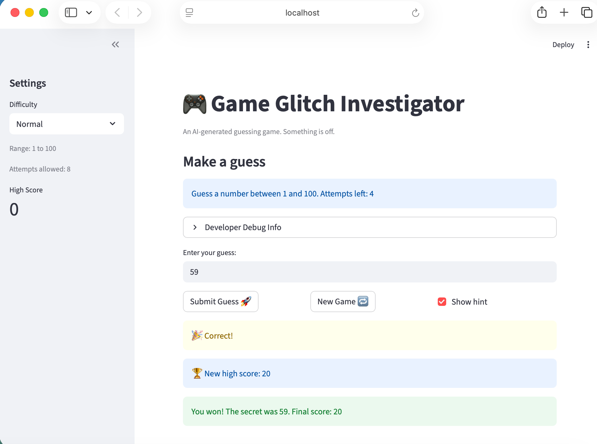
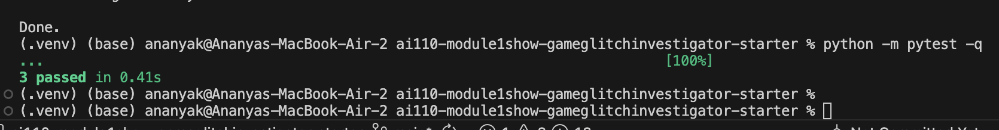

# 🎮 Game Glitch Investigator: The Impossible Guesser

## 🚨 The Situation

You asked an AI to build a simple "Number Guessing Game" using Streamlit.
It wrote the code, ran away, and now the game is unplayable. 

- You can't win.
- The hints lie to you.
- The secret number seems to have commitment issues.

## 🛠️ Setup

1. Install dependencies: `pip install -r requirements.txt`
2. Run the broken app: `python -m streamlit run app.py`

## 🕵️‍♂️ Your Mission

1. **Play the game.** Open the "Developer Debug Info" tab in the app to see the secret number. Try to win.
2. **Find the State Bug.** Why does the secret number change every time you click "Submit"? Ask ChatGPT: *"How do I keep a variable from resetting in Streamlit when I click a button?"*
3. **Fix the Logic.** The hints ("Higher/Lower") are wrong. Fix them.
4. **Refactor & Test.** - Move the logic into `logic_utils.py`.
   - Run `pytest` in your terminal.
   - Keep fixing until all tests pass!

## 📝 Document Your Experience

- [ ] Describe the game's purpose.
Its a number guessing game; we're guessing a randomly chosen secret number within limited range and limited attempts and some hints.

- [ ] Detail which bugs you found.

(1) New Game button wasn't working, Hint was broken, developer hints were backwards. Higher/lower suggestion is broken (shows opposite)
(2) Was even accepting 0 as guessing value and negative scores
(3) Easy, medium, difficult levels dont seem to work sensibily, (the difficulty=Hard range is set to 1-50 instead of 500) Everything is medium level. Says we have value range of 1 to 100 only but there's no restriction of it in the game
(4) I noticed that when I play the first guess it should say 0th attempt but its saying 1st attempt
(5)Show Hint checkbox randomly changes the number of attempts left and the score as well.
(6)Game is adding 5 points for every even number of attempts, no error on entering negative numbers
(7)Seem to be state problems since new game is not restrarting game

- [ ] Explain what fixes you applied.
Stored secret in st.session_state so it persists across reruns, Swapped the higher/lower conditions in check_guess, Added st.session_state.status = "playing" to the New Game handler, Fixed difficulty ranges in game, Fixed the new game starting state, Added input range validation

## 📸 Demo

- [ ] [Insert a screenshot of your fixed, winning game here]

## Challenge 1

## Challenge 2
Used the co-pilot Agent Mode Feature for Persistent High Score - Added 'hight_score.txt' and in sidebar
When I win and beat the previous best, the game updates the in-memory high score, writes the new value to high_score.txt, shows a "New high score" message.

### How Agent Mode contributed

(1) Reviewed the game state flow and identified the safest integration points.
(2) Implemented helper functions for file I/O with graceful failure handling.
(3) Connected the feature to Streamlit session state and win-condition logic.

## 🚀 Stretch Features

- [ ] [If you choose to complete Challenge 4, insert a screenshot of your Enhanced Game UI here]
